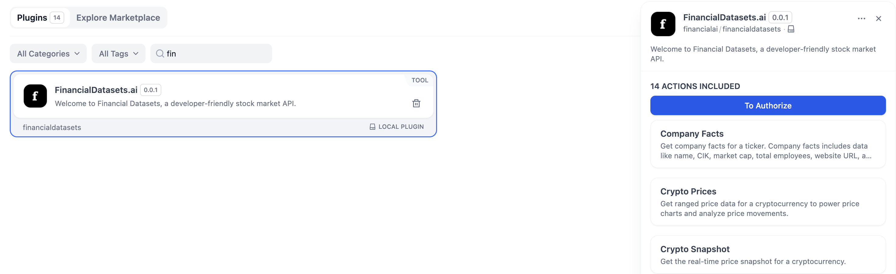
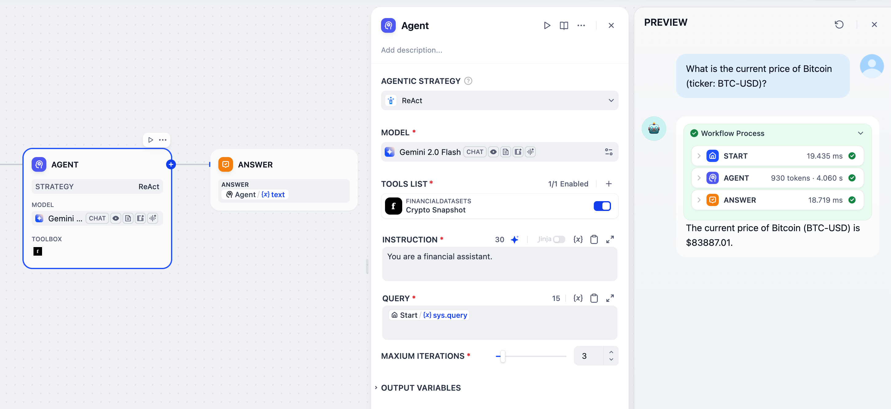

# Dify Plugin: FinancialDatasets.ai - Access Powerful Financial Data

## Overview

This Dify plugin empowers your AI applications with seamless access to the vast and reliable financial data provided by [FinancialDatasets.ai](https://financialdatasets.ai). FinancialDatasets.ai offers a comprehensive API for retrieving real-time and historical financial data across various asset classes, including stocks, cryptocurrencies, and more.

**With this plugin, you can:**

- **Enrich your Dify applications with real-time market data.**
- **Analyze historical trends and patterns using historical financial data.**
- **Build sophisticated financial analysis tools and dashboards within Dify.**
- **Integrate financial insights into your conversational AI agents and workflows.**

This plugin acts as a bridge, allowing you to leverage the power of FinancialDatasets.ai's API directly within the Dify platform, simplifying the process of data integration and empowering you to build data-driven AI solutions for finance.

**Visit the official [FinancialDatasets.ai documentation](https://docs.financialdatasets.ai/) to explore the full capabilities of their API.**

## Configuration

Before using this plugin, you'll need to configure it with your FinancialDatasets.ai API key. Here's how:

1. **Sign up for a FinancialDatasets.ai account:** If you don't already have one, create an account at [https://financialdatasets.ai](https://financialdatasets.ai).
2. **Obtain your API Key:** Log in to your FinancialDatasets.ai dashboard and locate your API key. This is usually found in your account settings or API documentation section.
3. **Configure the Dify Plugin:**
   - In your Dify project, navigate to the "Plugins" section.
   - Find and enable the "FinancialDatasets.ai" plugin.
   - In the plugin configuration settings, you will find a field to enter your **FinancialDatasets.ai API Key**.
   - Paste your API key into the designated field.
   - **Save the plugin configuration.**

**Important:** Keep your API key secure and do not expose it in public code repositories.

    

## Tool Features

This plugin exposes the following tools, allowing you to access specific functionalities of the FinancialDatasets.ai API within Dify. The specific tools available depend on the capabilities of the FinancialDatasets.ai API. Please refer to the [FinancialDatasets.ai documentation](https://docs.financialdatasets.ai/) for a complete list of endpoints and data available.

- **Company Facts**: Get company facts for a ticker. Company facts includes data like name, CIK, market cap, total employees, website URL, and more.
- **Crypto Prices**: Get ranged price data for a cryptocurrency to power price charts and analyze price movements.
- **Crypto Snapshot**: Get the real-time price snapshot for a cryptocurrency.
- **Earnings Press Releases**: Get earnings press releases for a ticker. The data returned from the API includes the URL, publish date, and full text of the press release.
- **Historical Financial Metrics**: Get financial metrics for a ticker, including valuation, profitability, efficiency, liquidity, leverage, growth, and per share metrics.
- **Financial Metrics Snapshot**: Get a real-time snapshot of key financial metrics and ratios for a ticker, including valuation, profitability, efficiency, liquidity, leverage, growth, and per share metrics.
- **Financial Statements**: Get all financial statements for a ticker, including income statements, balance sheets, and cash flow statements.
- **Insider Trades**: Get insider trades like buys and sells for a ticker by a company insider such as a CEO, CFO, or Director.
- **Institutional Ownership**: Get institutional ownership by investor or ticker. This quarterly data comes directly from Form 13F filings and includes tickers, share quantities, estimated holding prices, and market values.
- **Company News**: Get real-time and historical news for a ticker.
- **Stock Prices**: Get ranged price data for a ticker to power stock charts and analyze price movements.
- **Stock Snapshot**: Get the real-time price snapshot for a ticker.
- **SEC Filings**: Get SEC filings for a company. This includes 10-Ks, 10-Qs, 8-Ks, and more.
- **SEC Filing Items**: Get SEC filing items for a company. The Items endpoint allows you to extract specific sections (called items) from a given 10-K or 10-Q filing.

**Important:** When using these tools in Dify, ensure you provide the correct parameters. Refer to the FinancialDatasets.ai API documentation for accurate parameter names and data formats.

## Use Cases

Here are some examples of how you can utilize this FinancialDatasets.ai plugin in your Dify applications:

- **Financial Dashboard Assistant:** Build a Dify application that can answer user queries about current stock prices, historical trends, and market news, creating a personalized financial dashboard experience.
- **Automated Financial Reporting:** Create workflows that automatically fetch financial data using this plugin and generate reports for portfolio performance, market analysis, or investment insights.
- **AI-Powered Trading Bot (Informational):** Integrate real-time market data into a Dify-powered AI agent that can provide users with trading signals, market analysis, and risk assessments (Note: This plugin focuses on data retrieval and does not execute trades).
- **Financial News Summarization:** Combine this plugin with other Dify tools (like text summarization models) to fetch financial news headlines and provide concise summaries to users.
- **Educational Financial Applications:** Develop interactive educational applications that use real-world financial data to teach users about investing, market dynamics, and financial analysis concepts.
- **Personalized Financial Alerts:** Set up Dify workflows that monitor specific financial instruments and trigger alerts based on price movements or other data points retrieved via this plugin.

**Example Dify Chatflow Scenario:**

1. **User Input:** User asks "What is the current price of Bitcoin (ticker: BTC-USD)?"
2. **Dify Orchestration:** Dify identifies the intent and routes the request to the "Crypto Snapshot" tool from the FinancialDatasets.ai plugin.
3. **Plugin Execution:** The plugin uses the `symbol: BTC-USD` parameter to call the FinancialDatasets.ai API.
4. **API Response:** FinancialDatasets.ai API returns the real-time price of Bitcoin.
5. **Dify Output:** Dify presents the retrieved Bitcoin price to the user in a user-friendly format.

    

## Further Information

- **FinancialDatasets.ai Documentation:** [https://docs.financialdatasets.ai/](https://docs.financialdatasets.ai/) - Refer to the official API documentation for detailed information about available endpoints, data formats, rate limits, and more.
- **Dify Platform:** [https://dify.ai](https://dify.ai) - Learn more about the Dify platform and its capabilities for building AI applications.

## License

This Dify plugin is released under the [MIT License](LICENSE).

---

**Disclaimer:** This plugin provides access to financial data from FinancialDatasets.ai. Please be aware of the terms of service and data usage policies of FinancialDatasets.ai. Financial data is for informational purposes only and should not be considered financial advice. Always consult with a qualified financial advisor before making any investment decisions.
